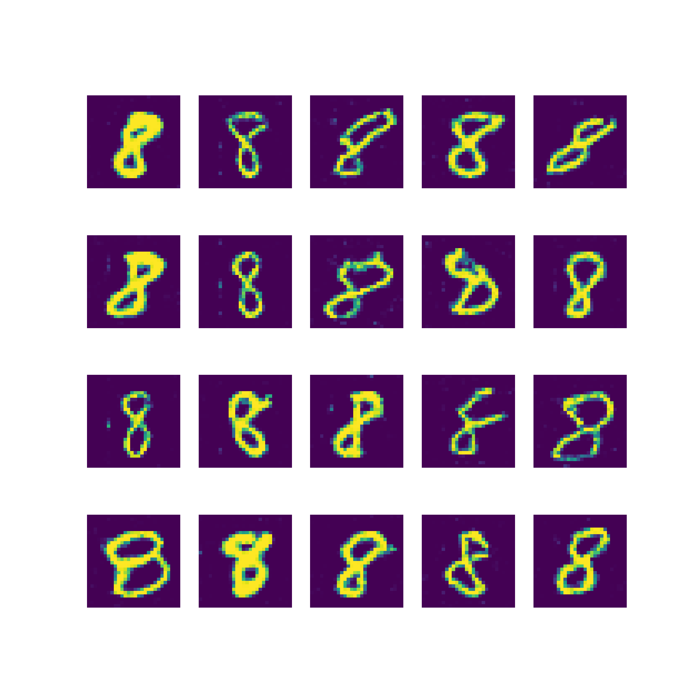
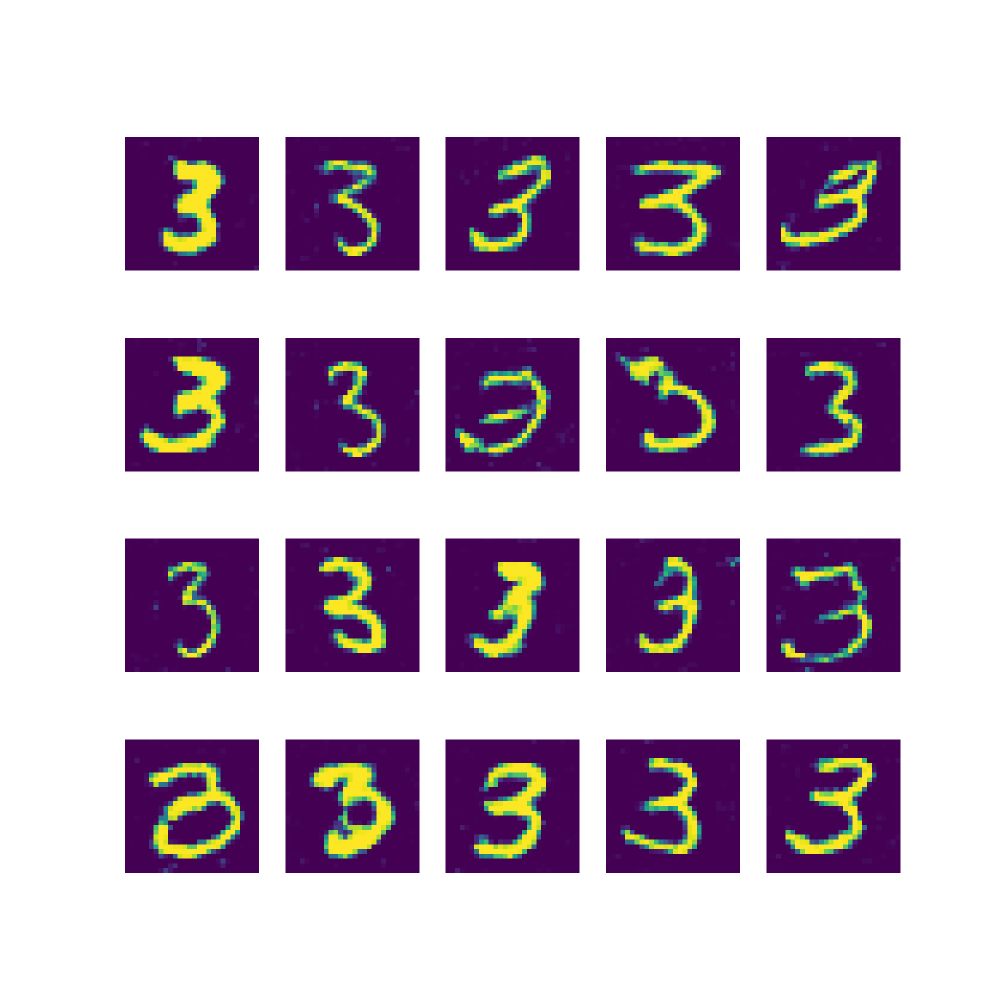
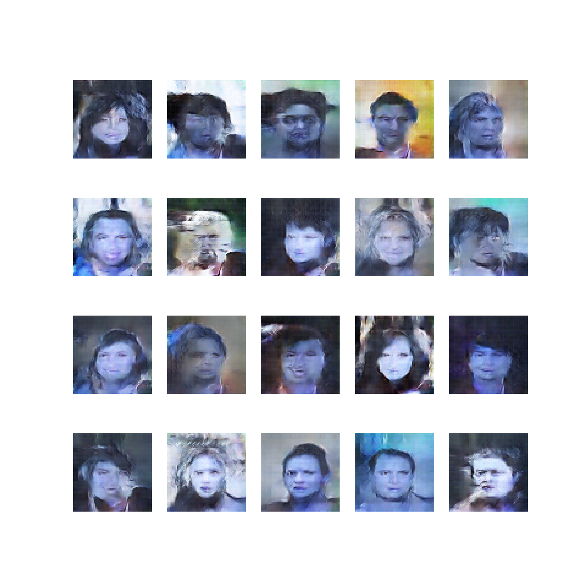

# GAN-Lightning

Basic to Advanced Implementation of Generative Adversarial Networks module,  powered by PyTorch Lightning. I created this repository to have hands-on experiences with different GAN architectures and datasets.

 This repository provides a flexible framework for training and evaluating Generative Adversarial Networks (GANs) using multiple architectures across different datasets. The goal is to create a modular and scalable system that allows easy experimentation with various GAN models and datasets within a single codebase.

# Features

The repository supports several basic GAN architectures, allowing you to switch between them with minimal configuration changes.
Dataset Flexibility: Includes support for two distinct datasets. The system is designed to handle these datasets seamlessly, enabling straightforward dataset swapping.
Modular Design: The codebase is organized to facilitate the addition of new architectures and datasets, making it easy to extend the repository's capabilities.
Unified Training Pipeline: A single training script manages the training process for all architectures and datasets, simplifying the workflow.

# Debug Configurations
For easier debugging, training, onnx file exporting and evaluation, several pre-configured launch configurations are provided in the .vscode/launch.json file. These configurations allow you to quickly start the debugging process with different models and datasets.

## Dependencies
  -  `PyTorch Lightning`
  -  `PyTorch`
  -   `OpenCV`
  -   `Numpy`
  -   `Hydra`
  -    `Albumentation`

## How To Run

### Creating a Virtual Environment

    python3 -m venv virtual_env

### Activate the Enviorenment

    source path/to/virtual_env/bin/activate

### Download the Dependencies

    pip install -r requirements.txt

### Run the Module
Run the gan_lightning python module.

    python3 -m gan_lightning

## 1- MNIST DATASET

- The results of different GAN architectures on MNIST dataset are demonstrated below. If you want to train and do inferences on trained model, please check the training_configs folder and corresponding configuration yaml file.

### 1.1 SimpleGAN
  SimpleGAN consists of a SimpleGenerator and SimpleDiscriminator which contain linear layers.

  

  Here are the results of the SimpleGAN.

### 1.2. DeepConvGAN
  Deep Convolutional GAN (DeepConvGAN) is an advanced version of the traditional Generative Adversarial Network (GAN) that leverages deep convolutional neural networks to generate image.
  

### 1.3 ConditionalGAN
  Conditional GANs extend the traditional GAN framework by incorporating additional information, allowing for more controlled image generation. In a ConditionalGAN, both the generator and discriminator are conditioned on a specific label or input, enabling the generation of images that correspond to that label.

  The result when latent vector z is set to 8:
  

  The result when latent vector z is set to 3:
  

## 2- CelebA Dataset

### 1.1 DeepConvGAN
   
